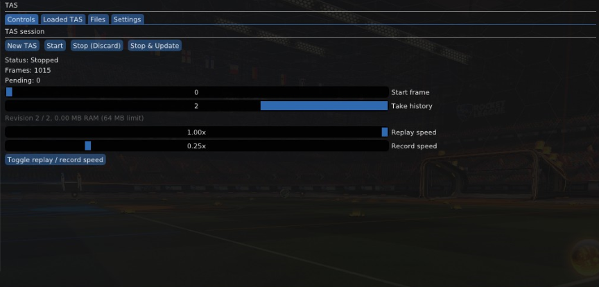

# Rocket League TAS Plugin

Hey! This is a tool-assisted replay editor plugin for BakkesMod. Basically, it allows you to record and edit Rocket League runs frame by frame. It captures the car, the ball, and all your controller inputs on every single frame, so you can test difficult shots, fix mistakes, and make super clean TAS runs.



## What it does (Features)

- **In-game GUI**: Works directly inside the BakkesMod menu (press F2 -> Plugins tab -> TAS).
- **Exact frame recording**: Saves the car position, rotation, ball physics, and controller inputs on every frame.
- **Branching / Editing**: You can jump back to an earlier part of the replay, take control, and record a new branch from there without having to redo everything from scratch.
- **Start frame slider**: Lets you easily scrub through frames and resume your run from wherever you want.
- **Undo and Redo**: Made a mistake? Press `Ctrl + Z` (or use `tas_undo`) to go back, and `Ctrl + Y` (or `tas_redo`) to go forward.
- **Take history slider**: Drag and release the slider to quickly switch between different takes and revisions.
- **Memory friendly**: It only saves the changed parts (frame tails) in RAM instead of copying the whole replay every time. It keeps up to 64 MB of history so your game doesn't eat all your RAM.
- **Different speeds for Replay & Record**: You can set separate speeds (for example, slow down time to 0.25x or 0.5x when recording hard inputs, and replay it at normal 1.0x speed).
- **Simple JSON format**: Runs are saved in clean and readable `.json` files.
- **Safety checks**: Automatically checks that your map, car hitbox, steering sensitivity, and aerial sensitivity match the original run so the physics don't get desynced.

## How to Use It

1. Open Rocket League and go into Freeplay or a custom workshop map.
2. Press `F2` to open BakkesMod, then go to **Plugins** -> **TAS** -> **Controls**.
3. Click on **New TAS** and give your run a name.
4. Set your Replay speed and Record speed (slowing down record speed helps a lot with hard mechanics).
5. In **Settings**, choose which button should interrupt the replay if you want to take over.
6. Pick where you want to start using the **Start frame** slider, and hit **Start**.
7. If the take went well, click **Stop & Update** to save it as a new revision.
8. If you messed up, click **Stop (Discard)** and it will cancel the take without saving it.
9. You can drag and release the **Take history** slider to browse your past attempts.
10. You can also use `Ctrl + Z` / `Ctrl + Y` to undo and redo moves.
11. When you're done, save your finished TAS under **Loaded TAS**.

> **Note on files & memory**: All saved TAS files go into BakkesMod's data folder under `TAS`. If you used the older `BakkesTAS` plugin before, don't worry, it will automatically copy over your old files when you run this for the first time. History is kept in RAM up to a 64 MB budget, and opening or creating a new TAS starts a clean history.

## Console Commands

If you like using the BakkesMod console (press `F6` or `~`), you can use these commands too:

- `tas_start [frame]` - Starts the replay or recording (optional: specify start frame).
- `tas_stop` - Stops the current run.
- `tas_update` - Updates the current run.
- `tas_stopandupdate` - Stops and immediately saves the take.
- `tas_undo` - Undo the last take (`Ctrl + Z`).
- `tas_redo` - Redo the undone take (`Ctrl + Y`).
- `tas_changespeed` - Toggle or adjust replay/record speed.

## Important Things & Compatibility

- **Sensitivity & Setup check**: The TAS will only start if your current map, car hitbox, steering sensitivity, and aerial sensitivity match the saved file exactly. Rocket League physics are very strict, so do not change your sensitivities during a run or it will desync!
- **Notifications**: I recommend enabling notifications in BakkesMod under the **Misc** tab, so you can see status popups and error messages if something doesn't match.

## How to Build

If you want to compile the plugin yourself from source, here is what you need:

### Requirements:
- Windows 10 or Windows 11
- Visual Studio 2022 (make sure the "Desktop development with C++" workload is installed)
- CMake 3.24 or newer

All other libraries (Ninja, BakkesMod SDK, ImGui, nlohmann/json) are already included inside the `vendor/` folder, so you don't have to download them separately.

### Build steps:

1. Open PowerShell in the project directory.
2. Run the build script:

```powershell
.\build.ps1
```

The compiled plugin will be in `dist\TAS.dll`. It also automatically builds and runs the core unit tests with CTest.

If you want it to build and copy the `.dll` directly into your BakkesMod plugins folder, run:

```powershell
.\build.ps1 -Deploy
```

Then in Rocket League, open the BakkesMod console (`F6`) and type:

```text
plugin load TAS
```

## Project Structure

- `src/` - Plugin C++ source code.
- `tests/` - Unit tests for session and history logic.
- `vendor/` - Required dependencies (BakkesMod SDK, ImGui, JSON library, etc.).
- `tools/` - Ninja compiler and setup scripts.
- `build/` - Folder generated by CMake during compilation.
- `dist/` - Where the built `TAS.dll` gets placed.
